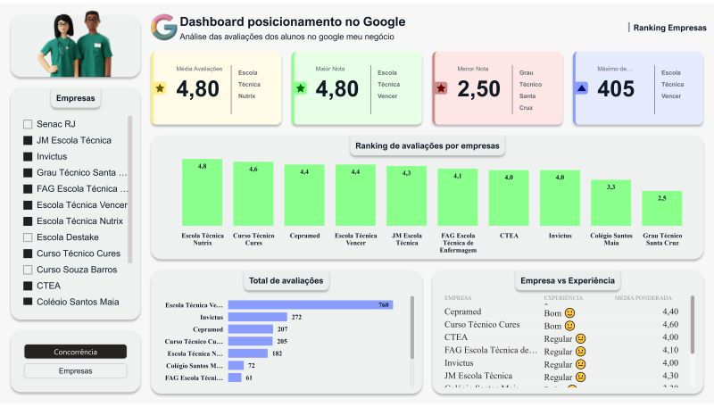

## Análise de Benchmarking de Escolas de Enfermagem no Google Meu Negócio

### Sobre o Projeto

**Analista:** Aryman Reis
**Período:** Dezembro de 2024
**Tipo:** Projeto Voluntário

Propor uma análise do posicionamento da empresa Invictus no mercado, com foco na percepção dos clientes. Para tanto, será realizado um estudo quantitativo das avaliações e pontuações da empresa no Google Meu Negócio, comparando-as com as dos principais concorrentes. O objetivo é identificar os pontos fortes e fracos da Invictus, compreender o nível de satisfação dos clientes e extrair insights estratégicos para otimizar sua atuação no mercado.

Perguntas que irei responder:
- Qual é a unidade Invictus melhor avaliada?
- Qual unidade tem o maior número de avaliações?
- Qual a média de avaliação da empresa Invictus?
- Qual é o posicionamento da Invictus em relação aos seus concorrentes?
- Qual é a empresa com a maior média de avaliações no meu mercado?

### Metodologia

A análise foi realizada utilizando a metodologia de benchmarking, comparando os dados das escolas de enfermagem com as melhores práticas do mercado.

### Ferramentas Utilizadas

  
  
  

### Dashboard Análise de concorrencia

### Linkedin

**https://www.linkedin.com/in/arymanreis/**

